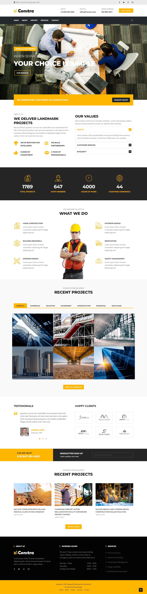

# <p align="center">Starting Point - Basic Laravel Website</p>

### Basic website in Laravel, created for website article **[https://ewvl.net](https://ewvl.net)**

[Creating A Basic Website With Laravel](https://ewvl.net/posts/creating-a-basic-website-with-laravel-part-1).

The theme was used **[Constra](https://themewagon.com/themes/free-bootsrap-4-html-5-business-website-template-constra)**, made available by https://themewagon.com at the address
[https://themewagon.com/themes/free-bootsrap-4-html-5-business-website-template-constra](https://themewagon.com/themes/free-bootsrap-4-html-5-business-website-template-constra)

### 🔧 Instalação

After cloning the repository, enter the directory where you installed it and run the commands below

```
composer install
```

And

```
php artisan key:generate
```

## 📄 License

[MIT](./LICENSE.md)

<p align="center"></p>

# Follow [ewvl.net](https://ewvl.net) ✌️ 👺 ✌️


